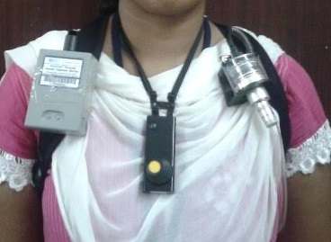

As you might remember from [my blog post about `ropenaq`](Using an *R* package as platform for harmonized cleaning of data from RTI MicroPEM air quality sensors), I work as a data manager and statistician for an [epidemiology project called CHAI](http://www.chaiproject.org/) for Cardio-vascular health effects of air pollution in Telangana, India. One of our interests in CHAI is determining exposure, and sources of exposure, to PM2.5 which are very small particles in the air that have diverse adverse health effects. In this blog post, I'll present a package we wrote for dealing with the output of a scientific device, which might remind you of similar issues in your experimental work.

Part of the CHAI project is a panel study involving about 40 people wearing several devices, as you see above. The devices includes a GPS, an accelerometer, a wearable camera, and a PM2.5 monitor outputting time-resolved data. Basically with these devices, the RTI MicroPEM, we get one PM2.5 exposure value every 20 second.